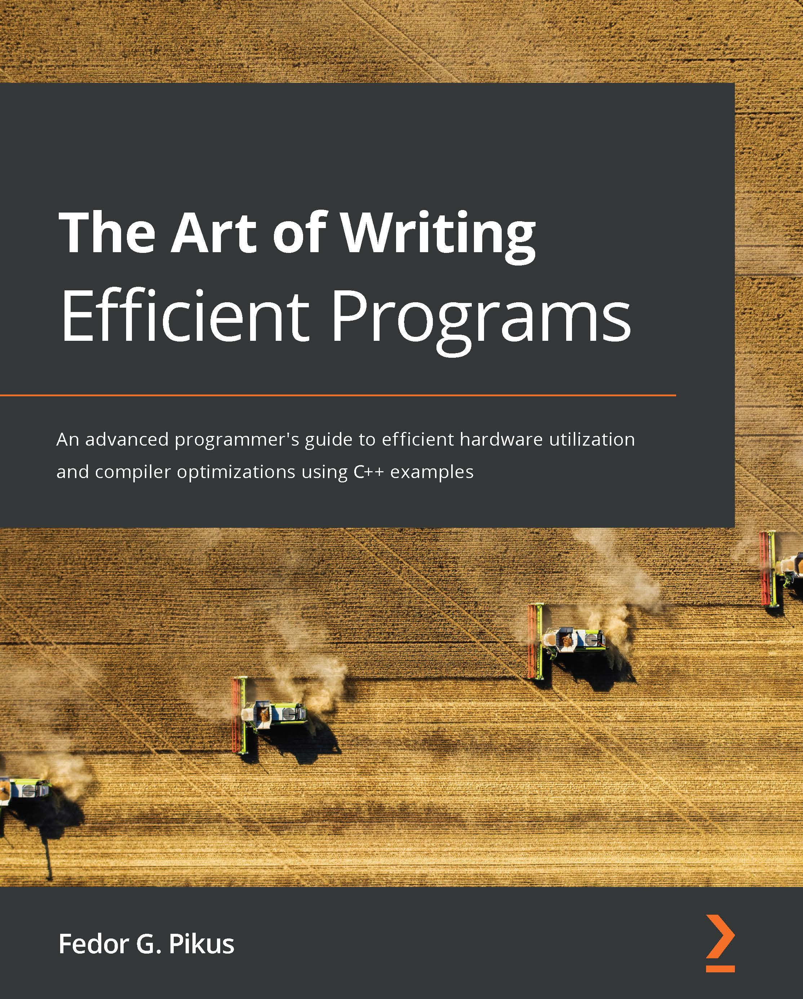

# The Art of Writing Efficient Programs

An advanced programmer's guide to efficient hardware utilization and compiler optimizations using C++ examples

(*一本高级编程指南，使用C++介绍如何高效利用硬件和编译器优化*)

* 作者：Fedor G. Pikus

* 译者：陈晓伟

* 首次发布时间：2021年10月22日([来源](https://www.amazon.com/Art-Writing-Efficient-Programs-optimizations/dp/1800208111/ref=sr_1_1?crid=3TMU5SFAS6D5M&keywords=The+Art+of+Writing+Efficient+Programs&qid=1643976993&sprefix=%E7%BE%8E%E5%9B%BD%E4%BA%9A%E9%A9%ACthe+art+of+writing+efficient+programs%E9%80%8A%2Caps%2C657&sr=8-1))

> 翻译是译者用自己的思想，换一种语言，对原作者想法的重新阐释。鉴于我的学识所限，误解和错译在所难免。如果你能买到本书的原版，且有能力阅读英文，请直接去读原文。因为与之相较，我的译文可能根本不值得一读。
>
> 
 — 云风，程序员修炼之道第2版译者

## 本书概述

*掌握各种性能提升技术，如并发性、无锁编程、原子操作、并行性和内存管理。*

性能自提升的时代结束了，以前随着CPU的升级，程序本身的速度也在加快，现在情况不一样了。新架构的处理器时钟频率几乎达到了峰值，对现有的程序性能上的改进并不多。虽然处理器的体积更大、性能更强，但这些能力的都在增多的核数和其他的计算单元上消耗掉了。为了编写高效的软件，现在的开发者必须了解如何利用现有的计算资源进行编程，这本书将说明如何做到这一点。

这本书涵盖了编写高效程序的主要方面：高效地使用CPU资源和内存，避免不必要的计算，性能测试，以及如何充分利用并发性和多线程。还会了解编译器优化，以及如何更有效地使用编程语言(C++)。最后，了解设计决策如何对性能产生影响。

读完这本书，可以利用处理器和编译器的知识来编写高效的程序，还能够理解使用这些技术和在提高性能时如何进行测试。而本书的核心在于学习的方法论。

#### 关键特性

- 了解现代CPU的局限性及对性能的影响
- 了解如何避免编写效率低下的代码，并使用编译器进行优化
- 了解编写高性能程序需要权衡策略和成本

#### 内容纲要

- 了解如何有效地使用程序中的硬件计算资源
- 理解内存序和内存栅栏之间的关系
- 熟悉不同数据结构和组织方式对性能的影响
- 评估并发内存访问对性能的影响，以及如何将影响最小化
- 了解何时使用和不使用无锁编程技术
- 探索提高编译器优化效率的不同方法
- 为避免效率低下的开发，针对并发和高性能数据结构设计API

## 适读人群

这本书是为有经验的开发人员和程序员编写的，他们从事对性能至关重要的项目，并希望学习不同的技术来提高代码的性能。属于算法交易、游戏、生物信息学、计算基因组学或计算流体动力学社区的开发者，可以从这本书中学习各种技术，并将其应用到他们的工作领域中。

虽然本书使用的是C++语言，但本书的概念可以很容易地转移或应用到其他编译语言，如C、Java、Rust、Go等。

## 作者简介

**Fedor G. Pikus**是Mentor Graphics公司(西门子公司)硅设计部门的首席工程科学家。他曾在谷歌担任高级软件工程师，在Mentor Graphics担任Calibre PERC、LVS、DFM的首席软件架构师。1998年，他从计算物理的学术研究转向软件行业，加入Mentor Graphics。Fedor是高性能计算和C++方面公认的专家，他的作品在CPPCon, SD West, DesignCon, Software Development Journal上进行过展示，也是O'Reilly的作者。作为首席科学家，他的职责包括规划Calibre产品的长期技术方向，指导和培训从事这些产品、软件设计和架构的工程师，以及研究新的设计和软件技术。Fedor在物理学、EDA、软件设计和C++语言方面拥有超过25项专利和超过100篇论文和会议报告。

> 我要感谢我的妻子加林娜(Galina)，我的儿子亚伦(Aaron)和本杰明(Benjamin)，他们支持和鼓励我，对我信心十足，还有我的猫维尼(Pooh)，也会在我需要的时候鼓励我。
>
> 
 —Fedor G. Pikus

## 审评者介绍

**Sergey Gomon**在12年前在白俄罗斯国立大学信息和无线电电子学院的人工智能系，开始了他的IT之旅。他在网络编程、信息安全、图像处理等多个领域拥有大约8年使用C++的工业编程经验。他目前在N-able工作，是CoreHard C++社区的活跃成员。

## 本书相关

* github翻译地址：https://github.com/xiaoweiChen/The-Art-of-Writing-Efficient-Programs
* 译文的LaTeX 环境配置：https://www.cnblogs.com/1625--H/p/11524968.html 

